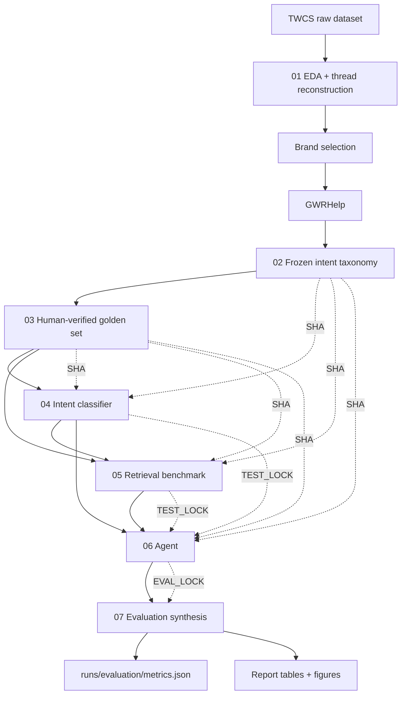
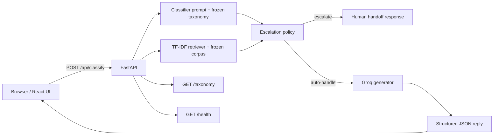
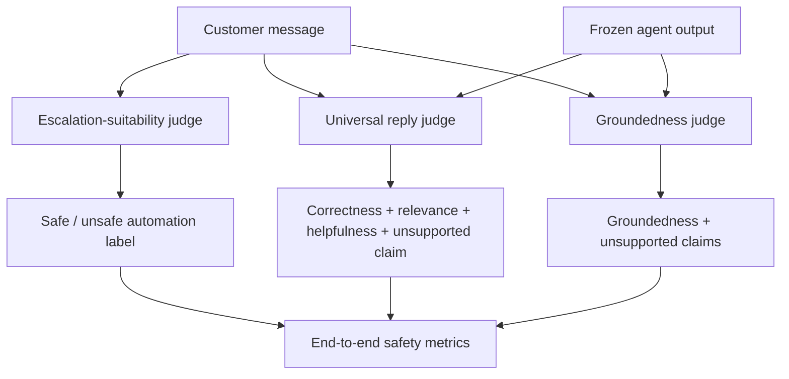
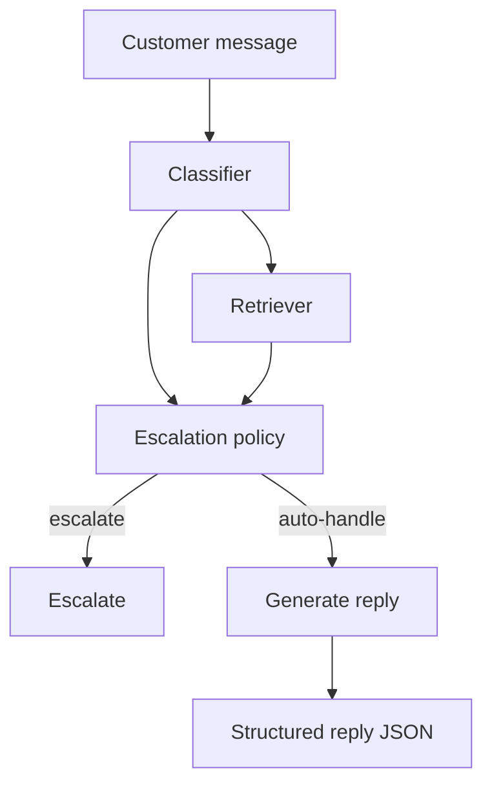

<p align="center">
  
</p>

# ResolveIQ

A selective, evaluation-first customer-support agent for **GWRHelp (Great Western Railway)** built on the **Customer Support on Twitter (TWCS)** dataset.

ResolveIQ takes a customer message and runs it through a frozen pipeline:

1. classify the customer's intent,
2. retrieve historical GWRHelp precedents,
3. decide whether the case should be auto-handled or escalated,
4. generate a concise support reply when it is not escalated, and
5. evaluate the system with separate quality, groundedness, and escalation-suitability judges.

The central design principle is **proof over polish**: the project deliberately freezes data, prompts, model selections, test predictions, and judging artifacts so that the final numbers can be traced to immutable inputs.

> **Important:** the current frozen agent is a documented evaluation result, not a production-ready support system. The selected agent fails its predeclared safety gate. That failure is preserved rather than hidden or tuned away.

---

## Results at a glance

| Stage | Frozen choice | Test result |
|---|---|---:|
| Intent classification | LLM classifier (`llm_zeroshot` in code; prompt uses curated examples) | Operational macro F1 **0.624** |
| Retrieval | TF-IDF, 1–2 grams, sublinear TF | Recall@5 **0.532** |
| Reply generation | `openai/gpt-oss-20b` via Groq | Mean universal score **13.37 / 15** |
| Safety | Independent escalation-suitability judge | Unsafe automation rate **0.597** |
| End-to-end | Frozen `ungrounded` fallback | Safe automation coverage **0.295** |

Test set: **139** examples. Retrieval corpus: **50** documents.

The most important finding is not the 13.37/15 reply-quality score: the selected agent auto-handles all 139 test cases while the independent suitability judge marks 83 as unsafe to automate. Only **29.5%** of test traffic is both handled correctly and considered safe under the evaluation protocol.

---

## Why ResolveIQ is structured this way

A customer-support agent is not just a text-generation problem. A plausible reply can still be operationally unsafe if it invents a policy, refund rule, timeline, eligibility condition, contact route, or action.

ResolveIQ therefore separates four questions:

- **Intent quality:** did the system understand the customer correctly?
- **Retrieval quality:** did it surface useful historical precedents?
- **Reply quality:** is the generated response correct, relevant, helpful, and free of unsupported operational claims?
- **Automation safety:** should this message have been handled automatically at all?

The system is intentionally evaluated as a cascade instead of collapsing everything into one score.

---

## Architecture

### Offline evaluation / experiment pipeline



### Runtime demo architecture

The API/UI is intentionally thin. It does not define the evaluation methodology; it loads the frozen artifacts produced by the pipeline and exposes them for interactive review.



### Evaluation architecture



The escalation-suitability judge receives **only the customer message**. It does not see classifier output, retrieval, or the generated response. This keeps the safety label independent of the pipeline being evaluated.

---

## Project workflow

The repository is deliberately organized as a seven-stage experiment rather than as a single opaque application.

| Stage | Notebook | Purpose | Frozen output |
|---|---|---|---|
| 01 | `notebooks/01_eda.ipynb` | Reconstruct threads, profile TWCS, shortlist brands | Brand-selection artifacts |
| 02 | `notebooks/02_taxonomy.ipynb` | Define and freeze GWRHelp intent taxonomy | `configs/intents.yaml` |
| 03 | `notebooks/03_golden_set.ipynb` | Build human-verified evaluation set | `runs/golden_set/` + promoted copy in `evaluation/` |
| 04 | `notebooks/04_classifier.ipynb` | Compare intent-classification approaches | `runs/classifier/` |
| 05 | `notebooks/05_retrieval.ipynb` | Benchmark historical-precedent retrieval | `runs/retrieval/` |
| 06 | `notebooks/06_agent.ipynb` | Compose classifier + retrieval + escalation + generation | `runs/agent/` |
| 07 | `notebooks/07_evaluation.ipynb` | Synthesize frozen test results | `runs/evaluation/` + `reports/` |

The test set is loaded only after the relevant upstream choice is frozen. Test-time predictions are then protected by SHA-based locks.

---

## 1. Data and brand selection

The project uses the **Customer Support on Twitter (TWCS)** dataset. The first notebook treats a customer conversation as the evaluation unit rather than sampling independent tweets.

Key decisions:

- threads are reconstructed using parent/root relationships,
- sampling is root/thread preserving,
- the response side is separated from the customer side,
- brand selection combines quantitative interaction quality with a manual thread audit.

### Why GWRHelp

The quantitative winner and qualitative audit winner differed, so the predefined tie-break rule was applied. The final score gap was **0.0137**, below the configured `0.10` threshold, which selected **GWRHelp**.

The choice is recorded in:

```text
configs/brand.yaml
runs/brand_selection/selection.json
```

Historical support replies are not treated as automatically correct policy documents. The EDA explicitly records the limitations of incomplete conversations, handoffs, investigation messages, and potentially outdated brand policies.

---

## 2. Frozen intent taxonomy

The taxonomy contains **11 intents**:

```text
1. delay_compensation
2. refund_request
3. booking_issue
4. timetable_info
5. service_disruption
6. seat_reservation
7. lost_property
8. on_board_issue
9. praise_or_chatter
10. other
11. ambiguous
```

The taxonomy is defined using operational boundaries and include/exclude rules instead of only keyword lists. Particular attention is given to difficult boundaries such as:

- `delay_compensation` vs `service_disruption`
- `delay_compensation` vs `refund_request`
- `seat_reservation` vs `on_board_issue`
- `booking_issue` vs `refund_request`

The frozen taxonomy is:

```text
configs/intents.yaml
runs/taxonomy/frozen/intents_v1.yaml
```

Taxonomy SHA-256:

```text
7a05e4af68a50981a3d38264b1aad8a4146fc90a342bb9804bcb5cb5148fe679
```

---

## 3. Golden evaluation set

The golden set is built on top of the frozen taxonomy and uses the **first inbound customer message of a GWRHelp thread** as the evaluation unit.

Important protocol rules:

- no root-level leakage across annotation pools and evaluation splits,
- normalized-text leakage is also checked,
- every retained example receives a human-confirmed `true_intent`,
- `confidence` and `ambiguous` are treated as different concepts,
- the set is coverage-oriented rather than prevalence-representative,
- the test split is locked before classifier/retrieval/agent test runs.

The frozen golden set contains **198 examples**, with **139 test examples**.

The canonical artifacts live under:

```text
runs/golden_set/
evaluation/golden_set.jsonl
```

Golden-set SHA-256:

```text
acde341dc09e85ae433d484ed8d38d4f388c0539c5523f861b6d1df36ba54817
```

---

## 4. Intent classifier

Four approaches were compared on development data:

1. rule-based classifier,
2. TF-IDF + logistic regression trained on rule labels,
3. TF-IDF + logistic regression trained on human labels,
4. LLM classifier (`llm_zeroshot` in the run artifacts).

The selected LLM configuration is `openai/gpt-oss-20b` through Groq with temperature 0 and structured JSON output. The notebook implementation also constructs a curated example block from the non-test human pool; the historical artifact keeps the approach name `llm_zeroshot`.

The chosen artifact is:

```text
runs/classifier/chosen.json
```

Test performance:

```text
Operational macro F1: 0.6238
All-class macro F1:   0.5513
Accuracy:             0.6043
```

The primary operational metric excludes the two residual classes from the headline macro F1. `ambiguous` has support 1 in the test set, so its per-class score is reported with a support warning.

### Main classifier failure

The largest boundary problem is:

```text
`delay_compensation` → `service_disruption`
```

`delay_compensation` test F1 is **0.286**. Eight of the 15 errors on that intent are confused with `service_disruption`.

This is intentionally documented rather than patched after the test, because changing the decision boundary after the test would invalidate the frozen one-shot protocol.

---

## 5. Retrieval

The retrieval corpus contains **50 historical GWRHelp precedents**. Each precedent is built from:

```text
first inbound customer message
        +
first substantive GWRHelp response
```

A substantive response is one of:

```text
resolution
informational
investigation
```

Handoff/empathy-only responses are retained as metadata but are not silently treated as authoritative resolutions. Threads with no substantive response are excluded from the primary grounding corpus and logged separately.

### Retrieval approaches

Development experiments include:

- random baseline,
- TF-IDF,
- BM25,
- embedding retrieval,
- hybrid RRF,
- oracle-intent BM25 diagnostic,
- predicted-intent BM25 diagnostic.

The declared selection rule uses **Recall@5** as the primary metric, with a `Δ ≤ 0.02` tie favoring the simpler/cheaper method.

The selected retriever is:

```text
TF-IDF
ngram_range=(1, 2)
sublinear_tf=True
```

Test results:

```text
Recall@5: 0.532
MRR:      0.342
Coverage: 0.942
```

### Important limitation

Automated retrieval relevance is proxied by intent match. A manual audit of 20 development queries / 100 judgments found:

```text
nDCG@5:              0.592
graded P@5 >= 1:     0.330
```

This means the intent-match benchmark is useful and reproducible, but it overstates how often retrieved precedents are actually useful for drafting a response.

The frozen corpus is:

```text
runs/retrieval/corpus.jsonl
```

Corpus SHA-256:

```text
69327018136200df2e8a6af81d72cc752d3f5c7f8365ba6149c2c76f73757872
```

---

## 6. Agent: escalation + generation

The agent composes the frozen classifier and retriever, then applies a predeclared routing policy.



The escalation policy reads:

- predicted intent,
- raw confidence,
- calibrated confidence,
- alternative confidence,
- corpus coverage.

Its configuration is frozen in:

```text
runs/agent/chosen_agent.json
```

with:

```text
τc = 0.40
τm = 0.15
escalate on other/ambiguous = true
escalate on zero coverage = true
```

### Generation

The generator uses `openai/gpt-oss-20b` via Groq, temperature 0, and structured JSON output. Its system prompt explicitly forbids inventing:

- policies,
- compensation amounts,
- eligibility rules,
- timelines,
- procedures,
- contact routes,
- operational actions.

The `grounded_no_escalate` and `full_pipeline` variants supply historical precedents to the same generation framework. The `ungrounded` variant does not provide precedents.

### Three independent evaluation questions

The agent notebook deliberately separates:

1. **Grounding:** does retrieved context improve reply quality?
2. **Generation:** are replies correct, relevant, helpful, and supported?
3. **Automation:** can the system safely automate useful traffic?

### Safety gate

The predeclared selection gate is:

```text
unsafe_automation_rate <= 0.10
```

No development candidate passed it.

The documented fallback therefore selected the simplest candidate, `ungrounded`. This is intentionally preserved as a finding rather than silently relaxed after observing the results.

Frozen test result for the chosen agent:

```text
Automation coverage:       1.000
Mean universal score:     13.37 / 15
Unsupported-claim rate:    0.194
Unsafe automation rate:   0.597
Escalation rate:           0.000
Safe automation coverage: 0.295
```

The agent's own safety gate therefore fails on the frozen test evaluation.

---

## 7. Evaluation and judging

Notebook `07_evaluation.ipynb` does not re-run upstream models. It only consumes frozen artifacts.

It verifies:

- taxonomy hash,
- golden-set hash,
- classifier `TEST_LOCK.json`,
- retrieval `TEST_LOCK.json`,
- agent `EVAL_LOCK.json`,
- root-id set equality,
- one-row-per-root constraints,
- cross-artifact truth consistency.

### Judges

#### Escalation-suitability judge

Input:

```text
customer message only
```

Output:

```text
auto_handle_safe
reasons[]
```

The rubric checks ambiguity, information sufficiency, policy support, risk, and complexity.

#### Universal reply judge

Input:

```text
customer message + candidate reply
```

Scores 1–5 on:

- correctness,
- relevance,
- helpfulness,

and separately flags unsupported operational claims.

#### Groundedness judge

Input:

```text
customer message + retrieved precedents + candidate reply
```

Scores whether operational claims are actually supported by the retrieved evidence. This judge is only applied to grounded replies.

Judge-human spot-check results:

```text
Universal judge Spearman rho:       0.722
Universal judge MAD:                0.67
Escalation-suitability agreement:   0.95
```

---

## 8. End-to-end evaluation

Notebook `07_evaluation.ipynb` produces the final synthesis under:

```text
runs/evaluation/
```

Key outputs include:

```text
metrics.json
end_to_end_test.jsonl
table_headline.csv
table_cascade.csv
table_per_intent.csv
table_slices.csv
table_length_bins.csv
table_decisions_by_intent.csv
table_confusion_pairs.csv
failure_mode_counts.csv
failure_cases_test.csv
limitations.md
```

### Safe automation coverage

A test case counts as safe automation only when the system:

1. classifies the intent correctly,
2. auto-handles instead of escalating,
3. produces a good reply,
4. is not flagged unsafe by the independent suitability judge, and
5. does not make an unsupported operational claim.

This is deliberately stricter than response quality alone.

### Failure attribution

The evaluation separates:

- `earliest_defect_stage` — the first pipeline stage that contains a defect,
- `observed_outcome` — what the customer would actually experience.

This distinction matters because a row can contain an upstream defect while still ending in a safe escalation.

---

## Figures

The evaluation/report figures live under `reports/figures/`.

The most useful end-to-end figures are:

- `pipeline_handling_cascade_test.png`
- `pipeline_cascade_test.png`
- `automation_by_intent_test.png`
- `automation_tradeoff_test.png`

Earlier diagnostic plots also cover brand selection, taxonomy exploration, thread structure, and classifier reliability.

---

## Demo API

The API is a **thin review layer** over the frozen pipeline.

### Endpoints

| Method | Endpoint | Purpose |
|---|---|---|
| `GET` | `/health` | Liveness + pipeline status |
| `GET` | `/taxonomy` | Frozen taxonomy |
| `POST` | `/classify` | Run the demo pipeline on a message |

Example request:

```json
{
  "message": "My train was 45 minutes late yesterday. Can I claim Delay Repay?",
  "top_k": 5,
  "force_escalate": false
}
```

The API loads the frozen taxonomy, classifier configuration, reliability table, retrieval corpus, generator configuration, and escalation configuration at startup.

Interactive Swagger docs:

```text
http://localhost:8000/docs
```

Health check:

```text
http://localhost:8000/health
```

---

## Frontend

The frontend is a Vite + React review UI. It shows the pipeline as four visible stages:

```text
01 Classify
02 Retrieve
03 Route
04 Generate
```

The interface exposes:

- sample customer queries,
- top-k retrieval control,
- force-escalate toggle,
- raw and calibrated confidence,
- retrieved historical precedents,
- cited precedent ranks,
- generated reply or escalation reason,
- frozen evaluation headline metrics.

The frontend proxies `/api/*` to the FastAPI server on port `8000`.

---

## Setup

### Prerequisites

- Python `>= 3.13`
- `uv`
- Node.js + npm
- A Groq API key for notebook/API generation paths

### Python environment

From the repository root:

```bash
uv sync
```

Create the environment file:

```bash
cp .env.example .env
```

Then set:

```text
GROQ_API_KEY=...
```

The raw TWCS dataset is expected at:

```text
data/raw/customer-support-on-twitter/twcs.csv
```

The raw dataset is intentionally not included in this repository.

### Run the experiment pipeline

Run notebooks in order:

```text
01_eda.ipynb
02_taxonomy.ipynb
03_golden_set.ipynb
04_classifier.ipynb
05_retrieval.ipynb
06_agent.ipynb
07_evaluation.ipynb
```

The later notebooks rely on frozen artifacts produced by earlier stages.

For a review of the already-frozen result, notebook `07_evaluation.ipynb` is the most useful entry point because it makes no generation/judging API calls and synthesizes the stored artifacts.

### Run the API

From the repository root:

```powershell
uv run uvicorn api.main:app --reload --port 8000
```

### Run the frontend

In another terminal:

```powershell
cd frontend
npm install
npm run dev
```

Open:

```text
http://localhost:5173
```

---

## Reproducibility and locks

ResolveIQ uses explicit SHA-256 locks to prevent accidental test drift.

### Frozen inputs

```text
configs/intents.yaml
runs/golden_set/golden_set.jsonl
runs/classifier/chosen.json
runs/retrieval/chosen_retriever.json
runs/retrieval/corpus.jsonl
runs/agent/chosen_agent.json
```

### Test/evaluation locks

```text
runs/classifier/TEST_LOCK.json
runs/retrieval/TEST_LOCK.json
runs/agent/TEST_LOCK.json
runs/agent/EVAL_LOCK.json
```

`07_evaluation.ipynb` verifies the upstream locks before producing the final evaluation artifacts.

The final report explicitly requires every reported number to trace back to frozen evaluation artifacts.

---

## Repository layout

```text
ResolveIQ/
├── api/                              # Thin FastAPI demo wrapper
│   ├── __init__.py
│   ├── main.py
│   └── pipeline.py
│
├── cache/                            # Local generated LLM/cache artifacts
│   ├── api_generated_replies.jsonl
│   ├── generated_replies.jsonl
│   ├── intent_predictions.jsonl
│   └── judge_scores.jsonl
│
├── configs/                          # Source-of-truth configuration
│   ├── brand.yaml
│   ├── intents.yaml
│   └── intents.yaml.template
│
├── data/                             # Dataset and intermediate data
│   ├── interim/
│   │   └── threads_sample.pkl
│   ├── processed/
│   ├── raw/
│   │   └── customer-support-on-twitter/
│   │       ├── sample.csv
│   │       └── twcs.csv
│   ├── sample/
│   └── README.md
│
├── evaluation/                       # Human annotation and evaluation artifacts
│   ├── annotation_guidelines.md
│   ├── candidate_audit.csv
│   └── golden_set.jsonl
│
├── frontend/                         # Vite + React review UI
│   ├── public/
│   │   ├── favicon.png
│   │   └── favicon.svg
│   ├── src/
│   │   ├── components/
│   │   │   ├── QueryForm.jsx
│   │   │   └── ResultPanel.jsx
│   │   ├── api.js
│   │   ├── App.css
│   │   ├── App.jsx
│   │   ├── index.css
│   │   ├── main.jsx
│   │   └── styles.css
│   ├── .gitignore
│   ├── .oxlintrc.json
│   ├── index.html
│   ├── package-lock.json
│   ├── package.json
│   └── vite.config.js
│
├── notebooks/                        # Seven-stage experiment pipeline
│   ├── 01_eda.ipynb
│   ├── 02_taxonomy.ipynb
│   ├── 03_golden_set.ipynb
│   ├── 04_classifier.ipynb
│   ├── 05_retrieval.ipynb
│   ├── 06_agent.ipynb
│   └── 07_evaluation.ipynb
│
├── reports/                          # Final report and generated figures
│   ├── figures/
│   ├── final_report.md
│   └── retrieval_handoff.json
│
├── runs/                             # Frozen experiment artifacts and locks
│   ├── agent/
│   ├── agent_v1/
│   ├── agent_v2/
│   ├── baseline_0/
│   ├── baseline_1/
│   ├── brand_selection/
│   ├── classifier/
│   ├── evaluation/
│   ├── golden_set/
│   ├── retrieval/
│   └── taxonomy/
│
├── src/
│   └── support_agent/                # Reusable runtime/evaluation modules
│       ├── escalation/
│       │   ├── __init__.py
│       │   └── policy.py
│       ├── evaluation/
│       │   ├── __init__.py
│       │   ├── judge.py
│       │   └── risk_coverage.py
│       ├── generation/
│       │   ├── __init__.py
│       │   └── generator.py
│       └── retrieval/
│           ├── __init__.py
│           ├── index.py
│           └── retriever.py
│
├── .env.example
├── .gitignore
├── .python-version
├── DECISIONS.md                      # Methodology and design decisions
├── main.py
├── pyproject.toml
├── README.md
└── uv.lock
```

---

## Known limitations

This repository intentionally preserves the following limitations:

- The golden test set is coverage-oriented rather than prevalence-representative.
- The test set contains 139 examples; small classes such as `ambiguous` have very low support.
- The retrieval corpus contains only 50 documents and is therefore a smoke-test-scale corpus.
- Retrieval relevance is evaluated primarily via intent match, which is an imperfect proxy.
- Historical replies can contain outdated policies.
- LLM judges are not perfect substitutes for large-scale human evaluation.
- Cost and latency were not captured in the frozen run.
- The current escalation policy does not discriminate safe from unsafe messages well enough.
- The frozen selected agent fails its own safety gate.

These limitations are part of the result, not hidden implementation details.

---

## What the project learned

### 1. Classification is the current bottleneck

55 of 139 test examples are incorrectly classified. Downstream components inherit those mistakes.

### 2. Boundary definitions matter more than generic model size

The `delay_compensation` / `service_disruption` boundary contributes a large share of classification failures. The next iteration should improve the taxonomy examples and boundary-specific training data before adding architectural complexity.

### 3. More retrieval context is not automatically better

The grounded variant reduced dev reply quality by roughly **0.51** points and increased unsupported operational claims. Weakly relevant precedents can give a generator false confidence.

### 4. A good-looking reply is not the same as a safe reply

The universal quality judge produced a strong average score, while the separate unsupported-claim and escalation-suitability signals showed substantial safety problems. This is why ResolveIQ reports multiple headline metrics.

### 5. Evaluation design is part of the system

The most important engineering artifacts are not only the classifier and retriever. They are also the frozen taxonomy, disjoint golden set, one-shot test protocol, SHA locks, independent judges, failure attribution, and report handoff.

---

## Future work

The next version should focus on the failure modes already demonstrated by the frozen evaluation:

1. strengthen `delay_compensation` vs `service_disruption` with explicit contrastive examples,
2. increase the historical precedent corpus beyond 50 documents,
3. add stronger precedent relevance gating before passing context to generation,
4. separate grounded and ungrounded generation prompts rather than using a shared prompt with competing instructions,
5. incorporate an independently validated safety signal into the runtime escalation policy,
6. add unsupported-claim post-processing,
7. capture latency and cost by stage,
8. re-evaluate the next system on a **fresh holdout** rather than modifying the current test set.

---

## Methodology log

`DECISIONS.md` records the major methodological decisions chronologically. It currently contains 25 decisions covering:

- thread-level sampling,
- brand-selection tie-breaking,
- taxonomy freezing,
- golden-set construction,
- classifier selection,
- retrieval relevance proxies,
- leakage prevention,
- escalation-judge independence,
- safety-gate selection,
- judging locks,
- failure attribution,
- test-set immutability.

This log is part of the reproducibility story and should be read alongside the notebooks.

---

## License / data note

The repository does not ship the raw TWCS dataset. Keep raw customer-support data under the ignored `data/raw/` path and do not commit secrets or API keys.

---

## Status

**Evaluation:** complete and frozen  
**Report:** complete  
**API demo:** available  
**Frontend demo:** available  
**Production readiness:** out of scope
